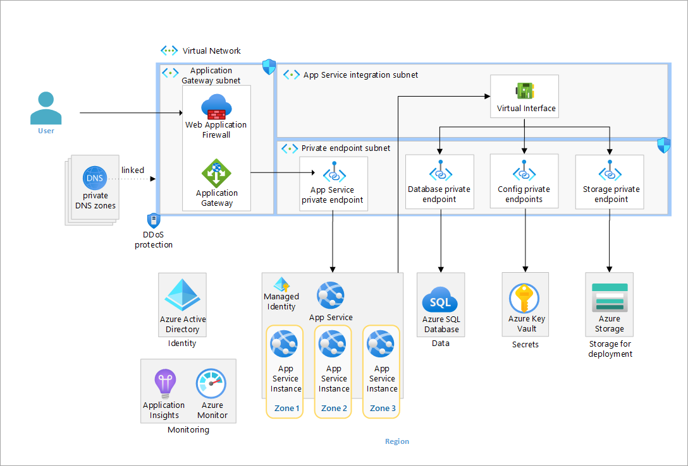

# App Services Baseline Architecture

This repository contains the Bicep code to deploy an Azure App Services baseline architecture with zonal redundancy. For more information on this architecture, see the guidance in the [Azure Architecture Center](https://learn.microsoft.com/en-us/azure/architecture/web-apps/app-service/architectures/baseline-zone-redundant).



## Deploy

The following are prerequisites.

### Prerequisites

1. Ensure you have an [Azure Account](https://azure.microsoft.com/pricing/purchase-options/azure-account?cid=msft_learn)
1. The deployment must be started by a user who has sufficient permissions to assign [roles](https://learn.microsoft.com/azure/role-based-access-control/built-in-roles), such as a User Access Administrator or Owner.
1. Ensure you have the [Azure CLI installed](https://learn.microsoft.com/cli/azure/install-azure-cli)
1. Ensure you have the [Azure Developer CLI (`azd`) installed](https://learn.microsoft.com/azure/developer/azure-developer-cli/install-azd)
1. Ensure PowerShell 7+ (`pwsh`) is available for hook execution

The deployment provisions a private Linux runner VM in the `snet-agents` subnet. During `azd up`, the post-provision hook uses that runner for steps that require private connectivity (app publishing and endpoint tests), so you can deploy infrastructure and application code in one command.

### Deploy with one command

1. In your command-line tool where you have Azure CLI and Azure Developer CLI installed, navigate to the root directory of this repository.

   ```bash
   git clone https://github.com/Azure-Samples/app-service-baseline-implementation.git
   cd app-service-baseline-implementation
   ```

1. Sign in and set your subscription.

   ```bash
   az login
   az account set --subscription <subscription-id-or-name>
   azd auth login
   ```

1. Update `deploy.config.json` with your values:
   - `BaseName`: 3-12 chars, lowercase letters/numbers/hyphens
   - `Location`: Azure region for deployment
   - `ResourceGroupName`: optional (leave empty for default)
   - `RunnerAdminUsername`: optional (defaults to `azureuser`)
   - `SqlServer`: database host/FQDN used by the app
   - `SqlDatabase`: database name
   - `SqlUsername`: database username
   - `SqlPassword`: database password (required)

   Example:

   ```json
   {
     "BaseName": "alfa-vmk",
     "Location": "swedencentral",
     "ResourceGroupName": "alfa-vmk-rg",
     "SqlServer": "sql-server-jn.database.windows.net",
     "SqlDatabase": "alfa-db",
     "SqlUsername": "alfa_read_user"
   }
   ```

   Security guidance:
   - Prefer not storing `SqlPassword` in `deploy.config.json`.
   - Set it in the `azd` environment instead:

   ```bash
   azd env set SQL_PASSWORD "<your-password>"
   ```

   During deployment, these values are stored as Key Vault secrets (`sql-server`, `sql-database`, `sql-username`, `sql-password`) and the web app reads them via Key Vault references using managed identity.

   Resolution behavior used by the preprovision hook:
   - If a key exists and is non-empty in `deploy.config.json`, that value is used.
   - If the key is missing/empty in `deploy.config.json`, the hook falls back to existing `azd` environment values, then defaults/prompts.
   - Managed keys are overwritten in the `azd` environment each run.
   - Keys removed from `deploy.config.json` are overwritten only when a default/prompt value is available for that key.
   - `RUNNER_ADMIN_PASSWORD` is regenerated on each run.

1. Run one command:

   ```bash
   azd up
   ```

### Avoid the initial azd resource group prompt

`azd` may prompt for resource group selection before hooks run. To ensure the
resource group from `deploy.config.json` is used automatically, initialize the
azd environment first:

```powershell
./scripts/init-azd-env.ps1 -EnvironmentName alfa-app
azd up --no-prompt
```

This stamps `AZURE_RESOURCE_GROUP` (plus other required variables) from
`deploy.config.json` into the selected azd environment before deployment starts.

   This run performs all required steps:
   - Stamps `azd` environment values from `deploy.config.json`
   - Provisions Azure infrastructure
   - Assigns storage RBAC for the app managed identity
   - Publishes the contents of `app/` via the private runner VM
   - Tests API endpoints through the private runner VM

### Retry guidance

- If `azd deploy` or `azd up` fails with `AADSTS700082` (expired refresh token), run `azd auth login` and retry.
- If deployment reports a transient Kudu restart/specialization error, rerun `azd up` once.

### Validate the web app

This section will help you validate the workload from a network that can resolve the App Service private endpoint, such as the provisioned runner VM or another connected host.

### Steps

1. Get the default App Service hostname.

   ```bash
   APP_SERVICE_HOSTNAME=$(az webapp show --resource-group $RESOURCE_GROUP --name "app-$BASE_NAME" --query defaultHostName --output tsv)
   echo APP_SERVICE_HOSTNAME: $APP_SERVICE_HOSTNAME
   ```

1. Confirm the hostname resolves to the private endpoint from your connected host.

   ```bash
   nslookup "$APP_SERVICE_HOSTNAME"
   ```

1. Browse to the site using HTTPS from that connected host.

   Open: `https://${APP_SERVICE_HOSTNAME}`

## Clean Up

After you are done exploring your deployed AppService refence implementation, you'll want to delete the created Azure resources to prevent undesired costs from accruing.

```bash
az group delete --name $RESOURCE_GROUP -y
az keyvault purge  -n kv-${BASE_NAME}
```

## Contributions

Please see our [contributor guide](./CONTRIBUTING.md).

This project has adopted the [Microsoft Open Source Code of Conduct](https://opensource.microsoft.com/codeofconduct/). For more information see the [Code of Conduct FAQ](https://opensource.microsoft.com/codeofconduct/faq/) or contact <opencode@microsoft.com> with any additional questions or comments.
